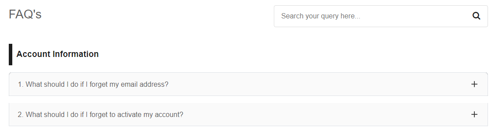

# AccordionWithSearch

Check out the live preview [here](https://6558d2430306dc78a994a8e4--effulgent-fairy-59bcf7.netlify.app/)

A micro component based project

This is a accordion with search functionality created using Angular.

Usecase ?

In situations where a business wants to address numerous queries, typically around 25 to 30 questions or more     Users prefer an efficient way to find answers. Instead of manually navigating through the accordion, users would opt to use a search bar for a more user-friendly experience, allowing them to quickly locate the information they need